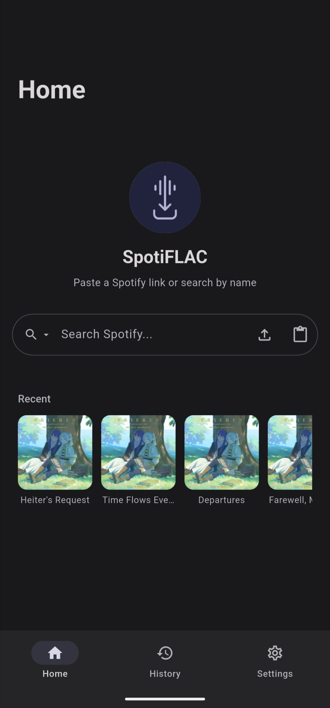
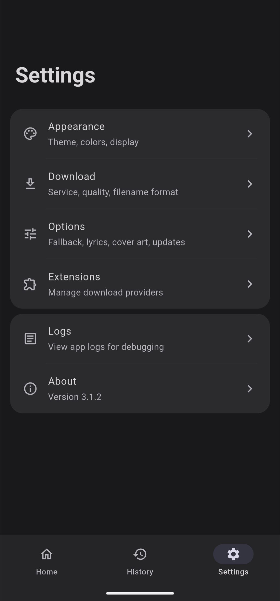

Get Spotify tracks in true FLAC from Tidal, Qobuz & Amazon Music — no account required.

### [Download](https://github.com/zarzet/SpotiFLAC-Mobile/releases)

## Features

- Download tracks, albums, and playlists from Spotify links
- True lossless FLAC quality from Tidal, Qobuz & Amazon Music
- Material Expressive 3 design with dynamic colors
- High performance rendering with Impeller (Vulkan)
- Concurrent downloads up to 3 simultaneous
- Real-time download progress tracking
- Download notifications

## Screenshots

  
  
  
  

## Other project

### [SpotiFLAC (Desktop)](https://github.com/afkarxyz/SpotiFLAC)
Get Spotify tracks in true FLAC from Tidal, Qobuz & Amazon Music for Windows, macOS & Linux

## Disclaimer

This project is for **educational and private use only**. The developer does not condone or encourage copyright infringement.

**SpotiFLAC** is a third-party tool and is not affiliated with, endorsed by, or connected to Spotify, Tidal, Qobuz, Amazon Music, or any other streaming service.

You are solely responsible for:
1. Ensuring your use of this software complies with your local laws.
2. Reading and adhering to the Terms of Service of the respective platforms.
3. Any legal consequences resulting from the misuse of this tool.

The software is provided "as is", without warranty of any kind. The author assumes no liability for any bans, damages, or legal issues arising from its use.
